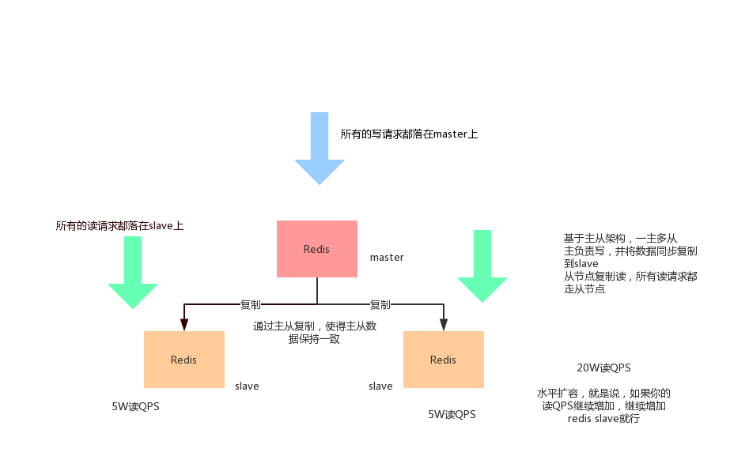
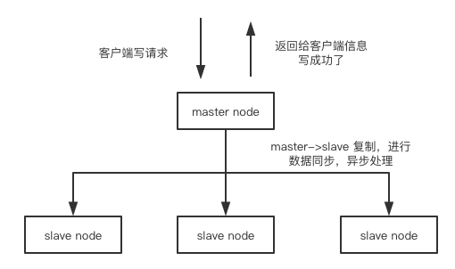

[TOC]

## 基本概念

单机Redis能够承载的QPS大概在上万到几万不等，对缓存来讲，一般用来支持读高并发，因此将架构做成主从架构，一主多从，主负责写，并将数据复制到slave节点，从节点负责。我们将所有的写请求交给master，所有的读请求交给slave，这样可以轻松读进行水平扩容，支撑读高并发

水平扩容：如果需要增加读QPS，则可通过水平扩容方式，增加相应slave节点来分担读请求，以达到更高的读QPS

redis replication --> 主从架构 --> 读写分离架构 --> 可支持水平扩展的读高并发架构

## 图解redis replication 基本原理

redis replication --> 主从架构 --> 读写分离架构 --> 水平扩容支撑读高并发架构

客户端通过master node进行写请求，master node将写结果告知客户端，通过异步的方式，将master数据同步复制给slave

## redis replication的核心机制

- redis通过异步方式复制数据到slave，从2.8开始，slave节点会周期性的确认自己每次复制的数据量
- 一个master node可以配置多个 slave node
- slave node 可以连接其他slave node
- slave node做复制的时候，不会阻塞master node的正常工作（因为数据复制是异步的）
- slave node在做复制的时候，不会阻塞对自己的查询操作，他会用旧的数据集来提供服务；但是复制完成后，会删除旧的数据集，加载新的数据集，此时会停止对外服务，暂停时间在毫秒到秒之间，看复制的数据量
- slave node主要用来进行横向扩容，做读写分离，扩容的slave node可以提供读的吞吐量

## master持久化对主从架构安全保障的意义

如果采用了主从架构，建议必须开启master node的持久化

不建议用slave node作为master node的数据热备，因为那样的话，如果未开启持久化，可能在master宕机重启的时候数据库是空的，然后经过复制，slave node数据被清空

第二个，master的需要有备份，防止本地所有文件丢失了，从备份中挑选一份rdb去恢复master，这样才能确保master启动的时候是有数据的

即使采用了高可用机制，slave node可以自动接管master node，但也可能sentinal（哨兵）还没检测到master failure，master node就自动重启了，还是可能导致上面的所有slave node数据清空

