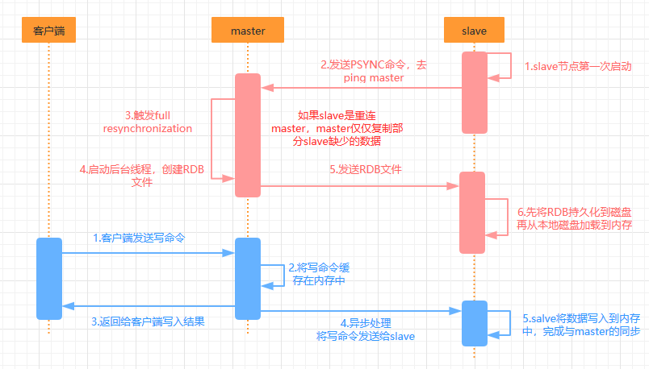
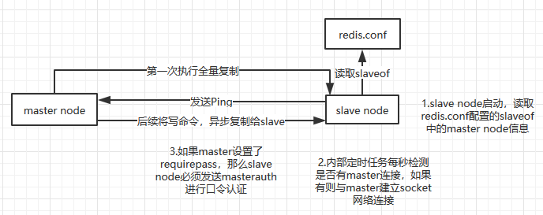

## 主从复制的核心原理

- 当启动一个slave node的时候，它会发送一个PSYNC命令给master node

  如果是slave重连master，master仅仅会复制slave部分缺少的数据

  如果是第一次连接，那么会触发master的full resynchronization全量同步，master会启动一个后台线程，生成一个RDB快照文件，同时还会接收客户端的写命令缓存到内存中。RDB生成完毕后，将这个RDB发送给slave，slave会先将RDB持久化到磁盘，再从本地磁盘加载到内存中。然后master会将缓存中的写命令发送给slave，slave也会同步这部分数据

- slave和master之间如果有网络故障，断开了连接，会自动重连，master如果发现有多个slave node都来重连，仅仅会启动一个rdb save操作，用一份数据服务多个slave

## 主从复制的断点续传

从redis 2.8开始，就支持主从复制的断点续传，如果主从复制过程中网络连接断了，那么恢复连接后会接着上次复制的地方继续复制，而不是从头开始

master node会在内存中维护一个backlog，master和slave都会保存一个replica offset还有一个master id，replica offset保存在backlog中，如果master和slave连接中断，恢复网络后，slave会让master从上一次的replica offset开始继续复制，如果找不到对应的offset，那么就会执行一次full resynchronization

## 无磁盘化复制

master 在内存中创建rdb，然后发送给slave，不会在自己本地落地磁盘

配置文件参数：

repl-diskless-sync

repl-diskless-sync-delay 5  //等待一定时长再开始复制，因为要等更多slave重新连接过来

## 过期key处理

slave不会过期key，只会等待master过期key。如果master过期了一个key，或者通过LRU淘汰了一个key，那么会模拟一条del命令发送给slave

------

## 复制的完整流程

（1）slave node启动，仅仅保存master node的信息，包括master node的ip和port，但是复制流程还没开始

master node的ip和port在redis.conf里面的slaveof配置的

（2）slave node内部有定时任务，每秒检测是否有master连接，如果有则与master建立socket网络连接

（3）slave node发送ping命令给master node

（4）口令认证，如果master 设置了requirepass，那么slave node必须发送masterauth的口令过去进行认证

（5）master node第一次进行全量复制，将所有数据发送给slave node

（6）master node后续持续将写命令，异步复制给slave node

## 数据同步的核心机制

指的是第一次slave连接master的时候，执行的全量复制，那个过程里面你的一些细节机制

（1）master和slave都维护一个offset

master会在自身不断累加offset，slave也会在自身不断累加offset

slave每秒都会上报自己的offset给master，同时master也会保存每个slave的offset

通过master和slave中的offset的差异性，才能知道数据不一致的情况

（2）backlog

master node有一个backlog，默认1MB大小

master node给slave node复制数据时，也会将数据在backlog中同步一份

backlog主要是用来做全量复制中断后的增量复制

（3）master run id

info server命令，可以看到master run id

根据host+ip定位master node不靠谱，如果master node重启或者数据发生了变化，slave node应该根据run id来区分，run id 不同就做全量复制

（4）psync

从节点使用psync从master node进行复制，psync runid offset

master node会根据自身的情况返回响应信息，可能是FULLRESYNC runid offset触发全量复制，可能是CONTINUE触发增量复制

## 全量复制

（1）master执行bgsave，在本地生成一份rdb快照文件

（2）master node将rdb快照文件发送给slave node，如果rdb复制时间超过60秒（repl-timeout）,那么slave node就会认为复制失败，可以适当调大这个参数

（3）对于千兆网卡的机器，一般每秒传输100MB，6G文件，很可能超过60s
（4）master node在生成rdb时，会将所有新的写命令缓存在内存中，在salve node保存了rdb之后，再将新的写命令复制给salve node
（5）client-output-buffer-limit slave 256MB 64MB 60，如果在复制期间，内存缓冲区持续消耗超过64MB，或者一次性超过256MB，那么停止复制，复制失败
（6）slave node接收到rdb之后，清空自己的旧数据，然后重新加载rdb到自己的内存中，同时基于旧的数据版本对外提供服务
（7）如果slave node开启了AOF，那么会立即执行BGREWRITEAOF，重写AOF

rdb生成、rdb通过网络拷贝、slave旧数据的清理、slave aof rewrite，很耗费时间

如果复制的数据量在4G~6G之间，那么很可能全量复制时间消耗到1分半到2分钟

## 增量复制

（1）如果全量复制过程中，master-slave网络连接断掉，那么salve重新连接master时，会触发增量复制
（2）master直接从自己的backlog中获取部分丢失的数据，发送给slave node，默认backlog就是1MB
（3）msater就是根据slave发送的psync中的offset来从backlog中获取数据的

## heartbeat

主从节点互相都会发送heartbeat信息

master默认每隔10秒发送一次heartbeat，salve node每隔1秒发送一个heartbeat

## 异步复制

master每次接收到写命令之后，现在内部写入数据，然后异步发送给slave node