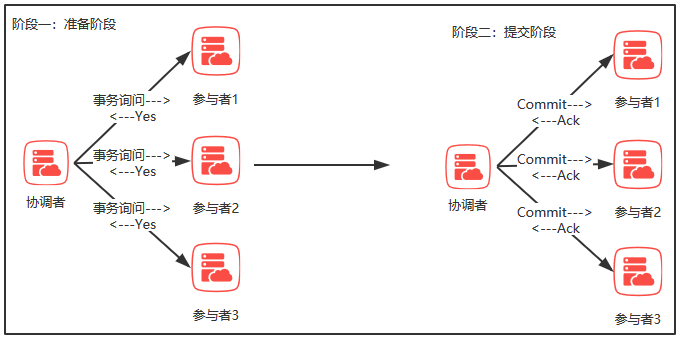
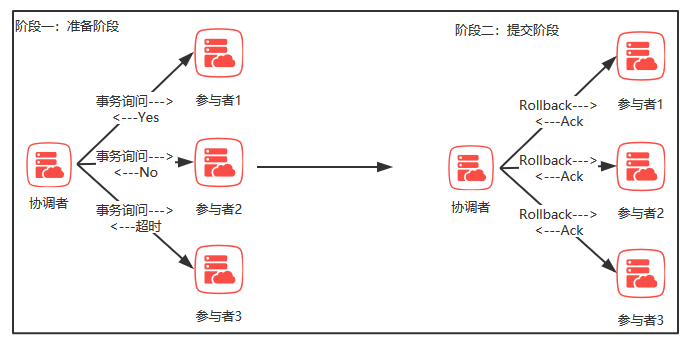
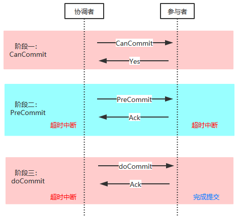

# 一致性协议

在分布式系统中，为了保持事务处理的ACID特性，引入一个称为”**协调者**“的组件来统一调度所有分布式节点的执行逻辑，这些被调度的分布式节点则被称为”**参与者**“。协调者负责调度参与者的行为，并最终决定这些参与者是否要把事务正真进行提交。

## 2PC

二阶段提交，为了使基于分布式系统架构下的所有节点在进行事务处理过程中能够保持原子性和一致性而设计的一种算法。用来保证分布式系统数据一致性。

### 阶段一：提交事务请求

1. 事务询问

   协调者向所有的参与者发送事务内容，询问是否可以执行事务提交操作，并开始等待各参与者的响应

2. 执行事务

   各参与者节点执行事务操作，并将Undo和Redo的信息记入事务日志中

3. 各参与者向协调者反馈事务询问的响应

   如果参与者成功的执行了事务操作，那么就反馈给协调者Yes响应，表示事务可以执行；如果参与者没有成功执行事务，那么就反馈给协调者No响应，表示事务不可以执行

### 阶段二：执行事务提交

​	所有参与者均返回Yes时，则提交事务；任何一个参与者反馈No，则中断事务

- 执行事务提交

  假如协调者从所有的参与者获取到的反馈都是Yes响应，那么会执行事务提交

  1. 发送提交请求

     协调者向所有参与者发送Commit请求

  2. 事务提交

     参与者接收到Commit请求后，会正式执行事务提交操作，并在完成提交之后释放在整个事务执行期间占用的事务资源。

  3. 反馈事务提交结果

     参与者在完成事务提交之后，向协调者发送Ack消息

  4. 完成事务

     协调者接收到所有参与者反馈的Ack消息后，完成事务
     
     

- 中断事务

  假如任何一个参与者向协调者反馈了No响应，或者在等待超时之后，协调者无法接收到所有参与者的反馈响应，那么就会中断事务

  1. 发送回滚请求

     协调者向所有参与者发送Rollback请求

  2. 事务回滚

     参与者接收到Rollback请求后，会利用一阶段中记录的Undo信息来执行事务回滚操作，并在完成回滚之后释放在整个事务执行期间占用的资源

  3. 反馈事务回滚结果

     参与者在完成事务回滚之后，向协调者发送Ack消息

  4. 中断事务

     协调者接收到所有参与者反馈的Ack消息后，完成事务中断
     
     

### 优缺点

- 优点：原理简单、使用方便

- 缺点：同步阻塞、单点问题、脑裂、太过保守

  - 同步阻塞

    在二阶段提交的的过程中，所有参与这个事务操作的逻辑都处于阻塞状态，也就是说各个参与者在等待其他参与者响应的过程中，将无法进行任何操作

  - 单点问题

    协调者在整个二阶段提交的

  - 脑裂：数据不一致，在执行第二阶段执行事务提交的时候，可能会发生局部网络异常或在尚未发送完所有`Commit`请求后协调者崩掉了，导致最终只有部分参与者收到`Commit`请求。

  - 太过保守

## 3PC

三阶段提交是2PC的改进版，将二阶段中的提交事务请求过程一分为二，形成了由`canCommit`，`PreCommit`和`doCommit`三个阶段组成的协议

### 阶段一：CanCommit

1. 事务询问

   协调者向所有的参与者发送一个包含事务内容的`canCommit`请求，询问是否可以执行事务提交操作，并开始等待参与者响应。

2. 各参与者向协调者反馈事务询问的响应。

   参与者在接收到协调者`canCommit`请求后，正常情况下返回Yes响应，并进入预备状态，否则反馈No响应。

### 阶段二：PreCommit

在阶段二中，协调者会根据各参与者反馈的结果来决定是否可以进行事务的`PreCommit`操作，正常情况下包含两种可能。

- 执行事务预提交

  如果参与者都反馈Yes，就会执行事务预提交。

  1. 发送预提交请求。

     协调者向所有参与者节点发送`preCommit`请求，并进入Prepared阶段

  2. 事务预提交

     参与者接收到`preCommit`请求后，会执行事务操作，并将`undo`和`redo`信息记录到事务日志中

  3. 各参与者向协调者反馈事务执行的响应

     如果参与者成功执行了事务操作，那么会反馈给协调者Ack响应，同时等待最终的指令：提交或终止

- 中断事务

  如果参与者有一个反馈了No，或者等待超时后，协调者未接收到某个参与者的响应，则会中断事务

  1. 发送中断请求

     协调者向所有参与者发送`abort`请求

  2. 中断事务

     无论是收到来自协调者的`abort`请求，或者是在等待协调者请求过程中出现超时，参与者都会中断事务

### 阶段三：doCommit

该阶段将会进行真正的事务提交，会存在以下两种可能

- 执行提交

  1. 发送提交请求

     向所有参与者发送`doCommit`请求

  2. 事务提交

     参与者收到`doCommit`请求后，会正式执行提交事务操作，并在完成提交之后释放在整个事务执行期间占用的事务资源

  3. 反馈事务提交结果

     参与者在完成事务提交之后，向协调者发送Ack消息

  4. 完成事务

     协调者接收到所有参与者反馈的Ack消息，完成事务

- 中断事务

  1. 发送中断请求

     向所有参与者发送`abort`请求

  2. 事务回滚

     参与者接收到abort请求后，利用在阶段二记录的undo信息来执行事务回滚操作，并在完成回滚之后释放整个事务执行期间占用的资源

  3. 反馈事务回滚结果

     参与者在完成事务回滚之后，向协调者发送Ack消息

  4. 中断事务

     协调者接收到所有参与者反馈的Ack消息，中断事务

注意：一旦进入阶段三，可能会存在以下两种故障

- 协调者出现问题
- 协调者和参与者之间网络出现故障

无论出现哪种情况，最终都导致参与者无法接受到来自协调者的`doCommit`或者是`abort`请求，针对这样的异常，参与者会在等待超时后继续提交事务

### 优缺点

优点：相比于2PC，降低了参与者的阻塞范围，并能够在出现单点故障后继续达成一致

缺点：在参与者接收到perCommit消息后，如果网络出现分区，此时协调者所在的节点和参与者无法进行正常的网络通信，这种情况下，参与者依然会执行事务提交，这必然导致了事务的不一致性

## Paxos 算法

