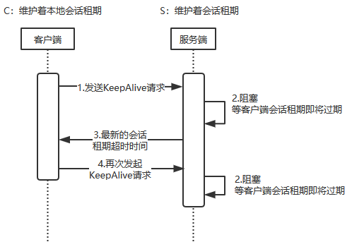
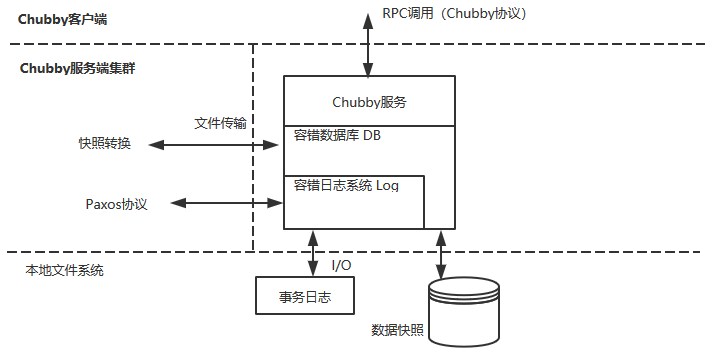

# Chubby

## 简介

- 面向松耦合分布式系统的锁服务

- 底层一致性实现基于Paxos算法

- 是一个粗粒度的锁服务

  客户端获得锁之后会长时间持有（数小时或数天），而非用于短暂获取锁的场景

- 典型场景：集群服务器的Master选举

## 锁服务优点

- 对上层应用程序侵入更小

  通过接口调用方式使用

- 便于提供数据的发布和订阅

  Master选举的场景下，需要广播告知客户端当前的Master服务器

- 开发人员对基于锁的接口更为熟悉

- 更便携地构建更可靠的服务

  通过一个分布式一致性算法都需要使用Quorum机制来进行数据项值的选定，Quorum机制是分布式系统中实现数据一致性的一个比较特殊的策略，它指的是在一个由若干个机器组成的集群中，在一个数据项值的选定过程中，要求集群存在**过半**的机器达成一致，也被称作“过半机制“。在Ghubby中通常使用5台服务器来组成一个集群单元（cell）

## Ghubby的设计目标

- 提供一个完整的、独立的分布式锁服务，而非仅仅是一个一致性协议的客户端库

- 提供粗粒度的锁服务

- 在提供锁服务的同时提供对小文件的读写功能

  当一个客户端成功获取到一个Chubby文件锁而成为Master后，就可以继续向这个文件里写入Master信息，其他客户端就可以通过读取这个文件得知当前的Master信息

- 高可用、高可靠

- 提供事件通知机制

## Chubby技术架构

### 系统结构

### 目录与文件

chubby对外提供了一套与unix文件系统非常相近但是更简单的访问接口，chubby命名空间包括文件和目录，我们称之为节点，在同一个chubby集群数据库中，每一个节点都是全局唯一的。

chubby数据节点都分为持久节点和临时节点两大类，其中持久节点需要显示的调用接口API来删除，而临时节点会在其对应的客户端会话失效后被自动删除。另外chubby上每个数据节点都包含少量元数据信息，包括用于权限控制的ACL信息和4个单调递增的64位编号

- 实例编号：

  标识节点创建的顺序，节点创建顺序不同，实例编号也不同，针对两个相同名字的节点可根据实例编号来感知创建的顺序

- 文件内容编号：文件内容编号用于标识文件内容变化情况，该编号会在文件内容被写入时增加

- 锁编号：锁编号用于标识节点锁状态变更情况，该编号在节点锁从自由状态转换到被持有状态增加

- ACL编号：用于标识节点的ACL信息变更情况，该编号会在节点的ACL配置信息被写入时增加

### 锁与锁序列器

在Chubby中采用锁延迟和锁序列器两种策略来解决由于消息延迟和重排引起的分布式锁问题。

- **锁延迟**：如果一个客户端的锁因为异常而被释放后，Chubby服务器会为该锁保留一定时间，在这段时间内，其他客户端无法获得锁，锁延迟错误可以很好的防止一些客户端由于网络闪退等原因而与服务器短暂断开的场景出现
- **锁序列器**：任何时候，锁的持有者都可以向Chubby请求一个锁序列器，其包括锁的名字，锁模式、以及锁序号。当客户端应用程序在进行一些需要锁机制保护的操作时，可以将该锁序列器一并发送给服务端，服务端收到请求后会检验该序列器是否有效，以及检查客户端是否处于恰当的锁模式，如果没有检查通过，那么服务器会拒绝该客户端请求

### 事件通知机制

客户端可以向服务端注册事件通知，当触发这些事件后，服务端会向客户端发送对应的事件通知。消息通知通过异步的方式发送给客户端，常见的事件如下：

- **文件内容变更**：记录Master信息的文件发生变更后，客户端可以监听这个文件来确定是否进行新的Master选举
- **节点删除**：当Chubby上节点被删除的时候，会产生“节点删除”事件。通常临时节点被删除后，客户端可以以此来判断该节点的客户端会话是否有效
- **子节点新增、删除**：当Chubby上指定节点的子节点新增或是减少时，会产生“子节点新增、删除”事件
- **Master服务器转移**：当Chubby服务器发生Master转移时，会以事件的形式通知客户端

### 缓存

在客户端中，Chubby会对文件内容和元数据信息进行缓存，在Chubby中通过租期机制来保证缓存一致性

Chubby缓存的声明周期和Master的租期机制紧密相关，Master会维护每个客户端的数据缓存情况，并通过向客户端发送过期信息的方式来保证客户端数据的一致性。每个客户端都有个缓存租期，到期后，客户端会重新向服务端续订租期以继续维持缓存的有效性。当文件数据或元数据信息被修改后，Chubby会先阻塞该操作，然后由Master向所有可能缓存了该数据的客户端发送缓存过期信号，以使缓存失效，等到Master接收到所有客户端应答后，再继续之前的修改操作

### 会话和会话激活

Chubby客户端和服务端之间通过创建一个TCP连接来进行所有的网络通信操作，我们将这一连接称为会话。会话存在一个超时时间，在超时时间内，客户端和服务端通过心跳检测来保持会话的活性，以使会话周期得到延续，这个过程称为KeepAlive（会话激活）

- KeepAlive请求：过程如下图所示

  1. 客户端向服务端发起KeepAlive请求

  2. 服务端接收到请求后会阻塞，等到客户端会话租期即将到期后才响应

  3. 服务端响应最新的租期超时时间给客户端
  4. 客户端收到响应后，立即再次发起KeepAlive请求
  5. 服务端阻塞，步骤2~4如此反复。所以正常请求过程中，客户端一定有个KeepAlive请求阻塞在服务器上

- 会话超时：

  除了服务端维持着一个会话租期外，客户端本地也维持着一个会话租期

  在上图中，在第三步过程中，客户端在本地会话租期超时时间内，没有收到来自服务端的KeepAlive响应，那么客户端无法确定Master服务端是否已经中止了当前会话，这个时候我们称客户端处于“危险状态”，这个阶段客户端会进行如下操作：

  1. 客户端会清空本地缓存，并将其标记为不可用
  2. 客户端还会等待一个称作为“宽期限”的时间周期，如果这段时间内，收到了服务端的响应，则重新启用本地缓存，否则客户端认为会话过期了从而中止本次会话。

  3. 客户端根据最终的状态，通过事件来通知上层程序，上层程序通过事件通知来判断是等待还是重启。

     - 刚进入“危险状态”，发送`jeopardy`事件

     - 恢复正常了，发送`safe`事件

     - 如果没能恢复过来，发送`expired`事件，告知上层程序Chubby会话超时

### Paxos协议实现

Chubby服务端基本架构分为3层：

- 最底层是容错日志系统

  通过Paxos算法能够保证集群中所有机器上的日志完全一致，同时具备较好的容错性

- 日志层之上是Key-Value类型的容错数据库

  通过下层日志来保证一致性和容错性

- 存储层之上是Chubby对外提供的分布式锁服务和小文件服务

其中Paxos算法的作用就是保证集群内各个副本节点的日志能够保持一致。Chubby事务日志中的每一个Value对应Paxos算法中的一个Instance，由于Chubby需要对外提供不间断的服务，因此事务日志会无线增长，于是在整个Chubby运行过程中，会存在多个Paxos Instance。同时，Chubby会为每一个Paxos Instance都按序分配一个全局唯一的Instance编号，并将其顺序写入到事务日志中去

在多Paxos Instance模式下，为了提升算法执行的性能，就必须选举出一个副本节点作为Paxos算法的主节点，避免每一个Paxos Instance都提出提案陷入多个Paxos Round并存的情况。

每一个Paxos Instance 都需要进行一轮或者多轮Prepare---->Promise---->Propose---->Accept这样完整的二阶段请求过程来完成对一个提案值的选定，而多个Paxos Instance之间是完全独立的，每个Paxos Instance可以自己决定每一个Round的序号，只需保证Instance内部不会重复即可。为了提高性能，可让多个Instance公用一套序号分配机制，并将Prepare---->Promise合并为一个阶段，具体做法如下：

- 当某个节点被选举为Master后，就会使用新分配的编号N来广播一个Prepare消息，该消息将会被所有未达成一致的Instance 和目前还未开始的Instance共用
- 当Acceptor接收到Prepare消息后，必须对多个Instance同时做出回应，这通常可以通过将反馈信息封装在一个数据包中来实现。假设最多允许K个Instance同时进行提案值的选定，那么
  - 当前最多存在K个未达成一致的Instance，将这些未决的Instance各自最后接受的提案值封装进一个数据包，作为Promise消息返回
  - 同时，判断N是否大于当前Acceptor的highPromisedNum值（当前以接受的最大提案值），如果大于的话，那么就标记这些未决的Instance和所有未来的Instance的highPromisedNum值为N，这样这些未决的Instance和未来的Instance都不能接受任何编号比N小的提案值
- 然后Master可以对所有未决和未来的Instance分别执行Propose---->Accept阶段处理。如果Master能够稳定运行，那么接下来的算法运行过程中，就不再需要进行Prepare---->Promise的处理，但是一旦Master发现Acceptor返回了一个Reject消息，说明集群中存在另一个Master，并且试图用更大的提案编号M发送Prepare消息，碰到这种情况当前Master就需要重新分配新的提案编号（大于M）并再次进行Prepare---->Promise阶段的逻辑处理

利用上述改进的Paxos算法，在Master稳定的情况下，只需要使用同一个编号来依次执行每一个Instance的Prepare---->Promise阶段处理逻辑，每个Instance执行的过程中，一旦接收到多数派的Accept反馈后，就可以将对应的提案值写入本地事务日志并广播Commit消息给集群中的其他副本节点，其他副本节点在接收到这个Commit消息之后也会将提案值写入到事务日志中去。如果某个节点因为宕机或者网络原因没有接收到Commit消息，可以主动向集群中的其他副本节点进行查询。因此，我们可以看到只要维持集群中多数派的机器能够正常运行，即使其他机器在任意时刻发生宕机，也能保证已经提交的提案的安全性。

# Hypertable

Hypertable是一个使用C++语言开发的开源、高性能、可伸缩的数据库，其目的是要构建一个针对分布式海量数据的高并发数据库

目前只支持增删改查功能，相比于传统的关系数据库相比，优势在于以下几点：

- 支持对大量并发请求的处理
- 支持对海量数据的管理
- 扩展性良好，在保证可用性的前提下，能够通过随意添加集群的机器来实现水平扩容
- 可用性极高，具有非常好的容错性，任何节点的失效，既不会造成系统瘫痪也不会影响数据的完整性

