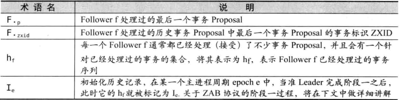
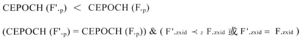

# 初识Zookeeper

## 概念

Zookeeper是一个开放源码代码的分布式协调服务，是一个典型的分布式数据一致性的解决方案，分布式程序可以基于它实现数据发布/订阅、负载均衡、命名服务、分布式协调/通知、集群管理、Master选举、分布式锁和分布式队列等功能。

Zookeeper可以保证如下分布式一致性特性：

- 顺序一致性：从同一个客户端发起的事务请求，最终会严格地按照发起顺序被应用到Zookeeper中去
- 原子性：所有事务请求的处理结果在集群中所有机器上的应用情况是一致的，要么整个集群中的机器都成功执应用了某一个事务，要么都没应用，一定不会出现局部应用，局部没应用
- 单一视图：无论客户端连接的是哪个Zookeeper服务，看到的数据模型都是一致的
- 可靠性：一旦服务端成功应用了事务，并完成了对客户端的响应，那么该事务所引起的服务端状态变更将被一直保存下来，除非另一个事务发起了更改
- 实时性：Zookeeper保证在一定的时间段内，客户端最终一定能够从服务端上读到最新的数据状态

未完成待补充.....

# ZAB协议

使用Zookeeper Atomic Broadcast（ZAB，Zookeeper原子消息广播协议）作为Zookeeper数据一致性的核心算法，支持崩溃恢复。

基于该协议，Zookeeper实现了一种主备模式的系统架构来保持集群中各副本之间的数据一致性。具体的，Zookeeper使用一个单一的主进程来接收并处理客户端的所有事务请求，并采用ZAB的原子广播协议，将服务器数据的状态变更以事务Proposal的形式广播到所有的副本进程上去。

## 消息广播

## 崩溃恢复

# 深入ZAB协议

## 系统模型

## 问题描述

- 主进程周期

- 事务

  使用epoch(z)表示一个事务标识中的主进程周期epoch、使用counter(z)表示事务标识的事务计数

## 算法描述

整个ZAB协议主要包括消息广播和崩溃恢复两个过程，进一步可以细分为三个阶段，分别为发现（Discovery）、同步（Synchronization）和广播（Broadcast）阶段。组成ZAB协议的每一个分布式进程会循环地执行这三个阶段，我们将这样一个循环称为一个主进程周期。

算法术语表：

- 阶段一：发现

  步骤F1.1：Follower F将自己最后接受的Proposal的epoch值CEPOCH(F.p)发送给准Leader L

  步骤L1.1：接受到过半Follower的CEPOCH(F.p)消息后，准Leader L会生成NEWEPOCH(e')消息给过半的Follower，准Leader L从所有接收到的CEPOCH(F.p)中选出最大的值，然后加1，得到e'

  步骤F1.2：当Follower接收来自准Leader L的NEWEPOCH(e')消息后，如果其检测到当前的CEPOCH(F.p)值小于e'，就将当前的CEPOCH(F.p)赋值为e'，同时向准Leader L反馈Ack消息。这个反馈消息(ACK-E(F.p,hf))中包含当前该Follower的epoch CEPOCH(F.p)，以及该Follower的历史事务Proposal集合：hf

  当Leader L接收来自过半Follower的ack消息后，就会从过半服务器中选出一个Follower F，并使用其作为初始化事务集合Ie'，关于Follower的选取，对于Quorum中的任意一个Follower F'，需要满足以下两个条件中的一个：

  

- 阶段二：同步

  步骤L2.1：Leader L会将e'和Ie'以NEWLEADER(e',Ie')消息的形式发送给所有Quorum中的Follower

  步骤F2.1：当Follower接收到来自Leader L的消息NEWLEADER(e',Ie')后，如果发现CEPOCH(F.p)不等于e',那么进入下一轮循环，因为此时Follower发现自己还在上一轮，或者更上一轮，无法参与本轮同步

  如果CEPOCH(F.p)等于e'，那么Follower就会执行事务应用操作，最后Follower会反馈给Leader，表名自己已经接受并处理了所有的Ie'中的事务Proposal

  步骤L2.2：当Leader L接收到来自过半Follower针对NEWLEADER(e',Ie')的反馈消息后，就会向所有的Follower发送Commit消息，至此Leader完成阶段二

  步骤F2.2：当Follower F接收到来自Leader 的Commit消息后，就会依次处理并提交所有在Ie''中未处理的事务，至此Follower完成阶段二

- 阶段三：广播

  完成同步后，ZAB协议就可以正式开始接收客户端新的事务请求，并进行广播流程

  步骤L3.1：Leader L接收到客户端新的事务请求后，会生成对于的事务Proposal，并根据ZXID的顺序向所有Follower发送提案<e',<v,z>>，其中cepoch(z)=e'

  步骤F3.1：Follower根据消息接收的先后次序依次来处理这些Leader的事务Proposal，并将它们追加到hf中去，之后再反馈给Leader

  步骤L3.2：当Leader 接收到来自过半Follower针对事务Proposal<e',<v,z>>的Ack消息后，就会发送Commit<e',<v,z>>消息给所有的Follower，要求它们进行事务的提交。

  步骤F3.2：当Follower接收到来自Leader的Commit<e',<v,z>>消息后，就会开始提交事务Proposal<e',<v,z>>。此时该Follower F必定已经提交了事务Proposal<e',<v‘,z’>>，其中<v',z'>属于hf，且z'<z

以上就是整个ZAB协议的三个核心流程，上述流程中各个消息说明如下：

CEPOCH：Follower向准Leader发送自己最后处理的事务Proposal的epoch值

NEWEPOCH：准Leader根据各Follower发送的epoch值，生成新一轮周期的epoch

ACK-E：Follower反馈准Leader发来的NEWEPOCH消息

NEWLEADER：准Leader确立自己的领导地位，并发送NEWLEADER消息给各进程

ACK-LD：Follower反馈Leader发来的NEWLEADER消息

COMMIT-LD：要求Follower进程提交相应的历史事务Proposal

PROPOSE：Leader进程生成一个针对客户端事务请求的Proposal

ACK：Follower反馈Leader发来的Proposal

COMMIT：Leader发送COMMIT消息，要求所有进程提交事务Proposal

## 运行分析

