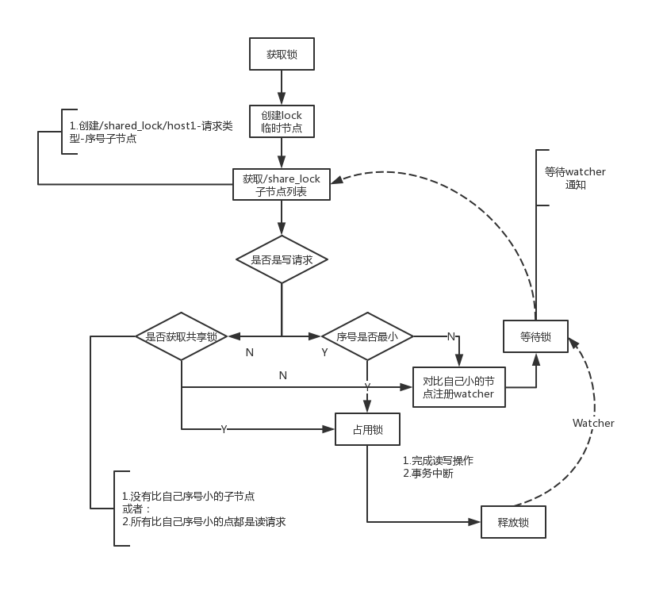

# Zookeeper的应用场景

## 1.数据发布/订阅

发布者将数据发布到Zookeeper的一个或一系列节点上，供订阅者进行数据订阅，进而达到动态获取数据的目的，实现配置信息的集中式管理和数据的动态更新

有两种设计模式：推模式和拉模式

- 推模式：服务器主动将数据更新发送给所有订阅的客户端
- 拉模式：客户端主动发起请求获取最新数据，通过客户端都采用定时进行轮询拉取的方式。

Zookeeper采用推拉结合的方式：客户端向服务端注册自己需要关注的节点，一旦节点数据发生变更后，那么服务端会向相应的客户端发送Watcher事件通知，客户端接收到这个消息通知之后，需要主动到服务端获取最新的数据。

## 2.负载均衡

负载均衡是一种相当常见的计算机网络技术，用来对多个计算机、网络连接、CPU、磁盘驱动器或其他资源进行分配负载，以达到优化资源使用、最大化吞吐率、最小化响应时间和避免过载的目的。负载均衡通常分为硬件和软件负载

## 3.命名服务

Zookeeper可以通过创建顺序节点的方式来构造全局唯一的ID

## 4.分布式协调通知

分布式协调/通知服务是分布式系统中不可缺少的一个环节，是将不同分布式组件有机结合起来的关键所在。例如分布式事务的处理，机器间的互相协调等，引入这样一个协调者可以大大减少系统之间的耦合性，显著提高系统的可扩展性

Zookeeper中特有的Watcher注册和异步通知机制，可以很好的实现分布式环境下不同机器，甚至不同系统之间的协调与通知，从而实现对数据变更的实时处理，通常的做法是不同的客户端都对Zookeeper上同一个数据节点进行Watcher注册，监听数据节点的变化，如果数据节点发生变化，那么所有订阅的客户端能够接收到相应的Watcher通知，并做出相应的处理

- 心跳检测

  基于Zookeeper的临时节点特性，可以让不同的机器都在Zookeeper的一个指定节点下创建临时节点，不同的机器之间可以根据临时节点判断对应的客户端是否存活，通过这种方式，检测系统和被检测系统不需要直接相关联，而是通过Zookeeper上的某个节点进行关联，大大减少了系统耦合

- 工作进度汇报

  在Zookeeper上选择一个节点，每个任务客户端都在这个节点下创建临时节点，这样便可以实现两个功能：

  - 通过判断临时节点是否存在来确定任务机器是否存活
  - 每个任务机器会实时的将自己的任务执行进度写到这个临时节点上去，以便中心系统实时地获取到任务的执行进度

- 系统调度

  一个分布式系统由控制台和一些客户端系统两部分组成，控制台的职责就是需要将一些指令信息发送给所有客户端，以控制他们进行相应的业务逻辑。实际上就是修改Zookeeper上某些节点的数据，从而把这些数据变更以通知的形式发送给对应的订阅客户端

## 5.集群管理

所谓集群管理包括集群监控和集群控制，前者侧重集群运行状态的收集，后者则是对集群进行操作与控制

Zookeeper具备两大特性：

- 客户端如果对Zookeeper的一个数据节点注册Watcher监听，那么当该数据节点的内容或是其子节点列表发生变更时，Zookeeper服务器就会向订阅的客户端发送变更通知

- 对在Zookeeper上创建的临时节点，一旦客户端与服务端之间的会话失效，那么该临时节点也就被自动清除。

利用这两大特性，就可以实现另一种集群机器存活性监控的系统

### 分布式日志收集系统

分布式日志收集系统的核心工作就是收集分布在不同机器上的系统日志，在这里我们重点看下分布式日志系统收集器模块。

在一个典型的日志系统架构设计中，整个日志系统会把所有需要收集的日志机器分为多个组别，每个组别对应一个收集器，用于收集日志，对于大规模的分布式日志收集场景，通常需要解决两个问题：

（1）变化的日志源机器：在生产环境中，伴随着机器的变动，每个应用的机器几乎每天都是在变化的（硬件问题，扩容，机房迁移或是网络问题都会导致一个应用的机器变化）也就是说每个组别中的机器通常都是在变化的

（2）变化的收集器机器：日志收集系统自身也会有机器的变化

使用Zookeeper我们可以很好的去监控每一台机器的变化状态

通常我们使用Zookeeper的临时节点，来判断收集机器的存活状态，但还要注意的一点是：在分布式日志收集这个场景下，收集器节点还会存放着所有分配给该收集器的日志源机器列表，如果简单依靠临时节点机制，那么当一个收集器机器挂掉后，待该收集器节点的会话失效后，Zookeeper会立即删除节点，于是记录在该收集器上的日志源机器列表信息也被清除，所有我们使用持久节点来标识每一个收集机器，在这个节点下创建status临时节点来收集每一个收集器的状态

### 在线云主机管理

监控集群机器，对机器的在线率统计有较高要求

- 机器上下线如何感知

  首先将指定的Agent部署到这些机器上去，Agent部署启动后，会首先向Zookeeper的指定节点注册，即在机器列表节点下创建一个临时节点，创建完节点后，对/XAE/machines节点关注的监控中心就会收到"子节点变更"事件，即上线通知，另一方面，监控中心同样可以获取到机器下线的通知，这样就实现了对机器上下线的检测，同时也很容易的获取到机器列表

  

- 机器监控

  一个在线云主机系统，不仅要对机器进行在线检测，还需要对机器的运行时状态进行监控。Agent会定时将主机的运行状态信息写入Zookeeper上的主机节点，监控中心通过订阅这些节点的数据变更通知来间接的获取主机的运行信息

## 6.Master选举

基于Zookeeper实现Master选举

## 7.分布式锁

分布式锁是控制分布式系统之间同步访问共享资源的一种方式。

- 排他锁

  称为写锁或独占锁，是一种基本的锁类型。如果事务T1对数据对象O1加上了排他锁，那么在整个加锁期间，只允许事务T1对O1进行读取和更新操作，其他任何事务都不能再对这个数据对象进行任何类型的操作，直到T1释放了排他锁。

  下面看看如何通过Zookeeper来实现排他锁：Zookeeper通过数据节点来表示一个锁

  - 获取锁：在需要获取排他锁时，所有的客户端都会试图通过调用create()接口，在/exclusive_lock节点下创建临时节点`/exclusive_lock/lock`，Zookeeper会保证在所有的客户端中，最终只有一个客户端能够创建成功，那么就认为该客户端获取了锁。同时没有获取到锁的客户端，需要到/exclusive_lock节点上注册一个子节点变更的Watcher监听，以便实时监听到lock节点的变更情况。

  - 释放锁：因为前面获取锁是通过创建临时节点来实现的，所以有以下两种情况会释放锁

    - 当获取锁的客户端宕机了，那么Zookeeper会移除这个临时节点
    - 正常逻辑处理完成后，客户端主动将自己创建的临时节点删除

    无论什么情况下移除了lock节点，Zookeeper都会通知所有在`/exclusive_lock`节点上注册了子节点变更Watcher监听的客户端。这些客户端在收到通知后，会重新发起分布式锁获取，即重复获取锁的过程

    

- 共享锁

  共享锁又称为读锁，如果事务T1对数据对象O1加上了共享锁，那么当前事务只能对O1进行读取操作，其他事务也只能对这个数据对象加共享锁，直到该数据对象上的所有共享锁都被释放了

  加上排他锁，数据只对一个事务可见，加上共享锁，数据对所有事务可见

  通过Zookeeper上数据节点表示一个锁，类似于`/shared_lock/[hostname]-请求类型-序号`的临时顺序节点

  - 获取锁

    在需要获取共享锁时，所有客户端都会跑到/shared_lock节点下创建一个临时顺序节点，如果当前请求是读请求，那么就创建例如`/shared_lock/192168.0.1-R-0000000001`的节点，如果是写请求，那么久创建例如`/shared_lock/192168.0.1-W-0000000001`的节点

  - 判断读写顺序

    1. 创建完节点后，获取`/shared_lock`节点下的所有节点，并对该节点注册子节点变更的Watcher通知

    2. 确定自己的序号节点在所有子节点中的顺序

    3. 对于读请求：

       如果没有比自己序号小的子节点，或是所有比自己序号小的子节点都是读请求，那么表明自己成功获取到共享锁，同时开始执行读取逻辑

       如果比自己序号小的节点中有写请求，那么需要进入等待

       对于写请求：

       如果自己不是最小的子节点，那么就需要进入等待

    4. 接收到Watcher通知后，重复步骤1

  - 释放锁

    释放锁的逻辑和排他锁中释放锁一致，整个共享锁获取释放流程如下

    

- 羊群效应

  我们看到在一个客户端释放锁之后，Zookeeper会发送watcher通知，其他客户端接收通知获取最新子节点列表，判断自己的读写顺序，而只有其中的一台客户端是可以去获取锁，其余的客户端接只能继续等待，而这watcher通知只对一台机器有实际影响，对其他客户端无作用

  大量的watcher通知和子节点列表获取两个操作重复执行，从而等待下一个通知，如果同一时间多个节点对于的客户端完成事务后，Zookeeper就会在短时间内向其余客户端发送大量的事件通知——这就是所谓的羊群效应

  每个节点对应的客户端只需要关注比自己序号小的那个相关节点的变更情况就可以了

- 改进后的分布式锁实现

  **集群规模不大，选择非改进版的，简单实用**

  1. 客户端调用create()方法创建一个类似于`/shared_lock/[hostname]-请求类型-序号`的临时顺序节点

  2. 客户端调用getChildren()接口获取所有已经创建的子节点列表，注意，这里不注册任何watcher

  3. 如果无法获取共享锁，那么就调用exist()来对比自己小的那个节点注册watcher

     读请求：向比自己序号小的最后一个写请求节点注册watcher监听

     写请求：向比自己序号小的最好一个节点注册watcher监听

     改进后的流程图如下：

     

## 8.分布式队列

