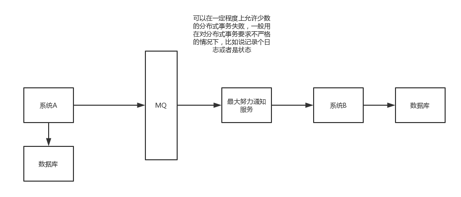

## 分布式事务

添加设备     本地和dac和irds如何保持一致

### 两阶段提交方案(XA方案)

第一阶段，询第二阶段，执行

一个系统协调多个库的事务，事务管理器先询问各个库是否准备好，如果每个库都回复ok，那么就正式提交事务，在各个数据库上执行操作，如果任何一个数据库回答不ok，那么就回滚事务

这种方案，比较适合在单块应用里，跨多个库的分布式事务，严重依赖于数据库层面来搞定复杂的事务，效率低，绝不适合高并发的场景

**很少用**

### TCC方案

Try，Confirm，Cancel

用到了补偿的概念，涉及到了三个阶段

- Try阶段：对各个服务的资源做检测以及对资源进行锁定或者预留
- Confirm阶段：在各个服务中执行实际的操作
- Cancel阶段：如果任何一个服务的业务方法执行出错，那么这里就需要补偿，就是**回滚**已经执行成功的业务逻辑

举例：

跨银行转账，涉及到两个银行的分布式事务

- Try阶段：先把两个银行账户中的资金冻住，不让操作
- Confirm阶段：执行转账操作，A银行账户资金扣减，B银行账户资金增加
- Cancel阶段：如果任一银行操作执行失败，那么就需要回滚进行补偿，比如A扣减成功了，B增加失败了，就需要把A的账户资金给加回去

这个事务回滚实际依赖自己写的代码来回滚补偿，会造成补偿代码巨大，恶心，维护难

一般来说跟钱打交道的，支付，交易相关的场景，会用TCC，严格保证分布式事务要么全部成功，要么全部自动回滚，严格保证资金的准确性

比较适合的场景：对一致性要求高，系统核心的核心的场景

最好业务逻辑执行时间较短

**很少用**

### 本地消息表

1）A系统在自己本地一个事务里操作同时，插入一条数据到消息表

2）接着A系统将这个消息发送到MQ中去

3）B系统接收到消息之后，在一个事务里，往自己本地消息表里插入一条数据，同时执行其他的业务操作，如果这个消息已经被处理过了，那么此时这个事务会回滚，这样保证不会重复处理消息

4）B系统执行成功之后，就会更新自己本地消息表的状态以及A系统消息表的状态

5）如果B系统处理失败了，那么就不会更新消息表状态，那么此时A系统会定时扫描自己的消息表，如果有没处理的消息，会再次发送到MQ中去，让B再次处理

6）这个方案保证了最终一致性，哪怕B事务失败了，但是A会不断重发消息，直到B那边成功为止

严重依赖数据库的消息表来管理事务，高并发场景不适用

**很少用**

### 可靠消息最终一致性方案

这个的意思，就是干脆不要用本地的消息表了，直接基于MQ来实现事务。比如阿里的RocketMQ就支持消息事务。

1）A系统先发送一个prepared消息到mq，如果这个prepared消息发送失败那么就直接取消操作别执行了

2）如果这个消息发送成功过了，那么接着执行本地事务，如果成功就告诉mq发送确认消息，如果失败就告诉mq回滚消息

3）如果发送了确认消息，那么此时B系统会接收到确认消息，然后执行本地的事务

4）mq会自动定时轮询所有prepared消息回调你的接口，问你，这个消息是不是本地事务处理失败了，所有没发送确认消息？那是继续重试还是回滚？一般来说这里你就可以查下数据库看之前本地事务是否执行，如果回滚了，那么这里也回滚吧。这个就是避免可能本地事务执行成功了，别确认消息发送失败了。

5）这个方案里，要是系统B的事务失败了咋办？重试咯，自动不断重试直到成功，如果实在是不行，要么就是针对重要的资金类业务进行回滚，比如B系统本地回滚后，想办法通知系统A也回滚；或者是发送报警由人工来手工回滚和补偿

### 最大努力通知方案

1）系统A本地事务执行完之后，发送个消息到MQ

2）这里会有个专门消费MQ的最大努力通知服务，这个服务会消费MQ然后写入数据库中记录下来，或者是放入个内存队列也可以，接着调用系统B的接口

3）要是系统B执行成功就ok了；要是系统B执行失败了，那么最大努力通知服务就定时尝试重新调用系统B，反复N次，最后还是不行就放弃

### 公司是如何处理分布式事务

你可以这么说，我们某某特别严格的场景，用的是TCC来保证强一致性；然后其他的一些场景基于了阿里的RocketMQ来实现了分布式事务

你找一个严格资金要求绝对不能错的场景，你可以说你是用的TCC方案；如果是一般的分布式事务场景，订单插入之后要调用库存服务更新库存，库存数据没有资金那么的敏感，可以用可靠消息最终一致性方案，友情提示一下，rocketmq 3.2.6之前的版本，是可以按照上面的思路来的，但是之后接口做了一些改变，我这里不再赘述了

### 分布式事务是否要加很多

你其实用任何一个分布式事务的这么一个方案，都会导致你那块儿代码会复杂10倍。很多情况下，系统A调用系统B、系统C、系统D，我们可能根本就不做分布式事务。如果调用报错会打印异常日志。

 

每个月也就那么几个bug，很多bug是功能性的，体验性的，真的是涉及到数据层面的一些bug，一个月就几个，两三个？如果你为了确保系统自动保证数据100%不能错，上了几十个分布式事务，代码太复杂；性能太差，系统吞吐量、性能大幅度下跌。

 

99%的分布式接口调用，不要做分布式事务，直接就是监控（发邮件、发短信）、记录日志（一旦出错，完整的日志）、事后快速的定位、排查和出解决方案、修复数据。

每个月，每隔几个月，都会对少量的因为代码bug，导致出错的数据，进行人工的修复数据，自己临时动手写个程序，可能要补一些数据，可能要删除一些数据，可能要修改一些字段的值。

比你做50个分布式事务，成本要来的低上百倍，低几十倍

trade off，权衡，要用分布式事务的时候，一定是有成本，代码会很复杂，开发很长时间，性能和吞吐量下跌，系统更加复杂更加脆弱反而更加容易出bug；好处，如果做好了，TCC、可靠消息最终一致性方案，一定可以100%保证你那快数据不会出错。

 1%，0.1%，0.01%的业务，资金、交易、订单，我们会用分布式事务方案来保证，会员积分、优惠券、商品信息，其实不要这么搞了

